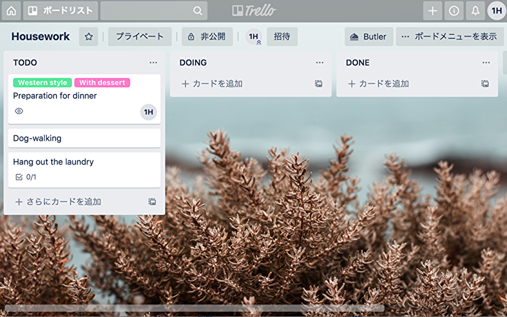
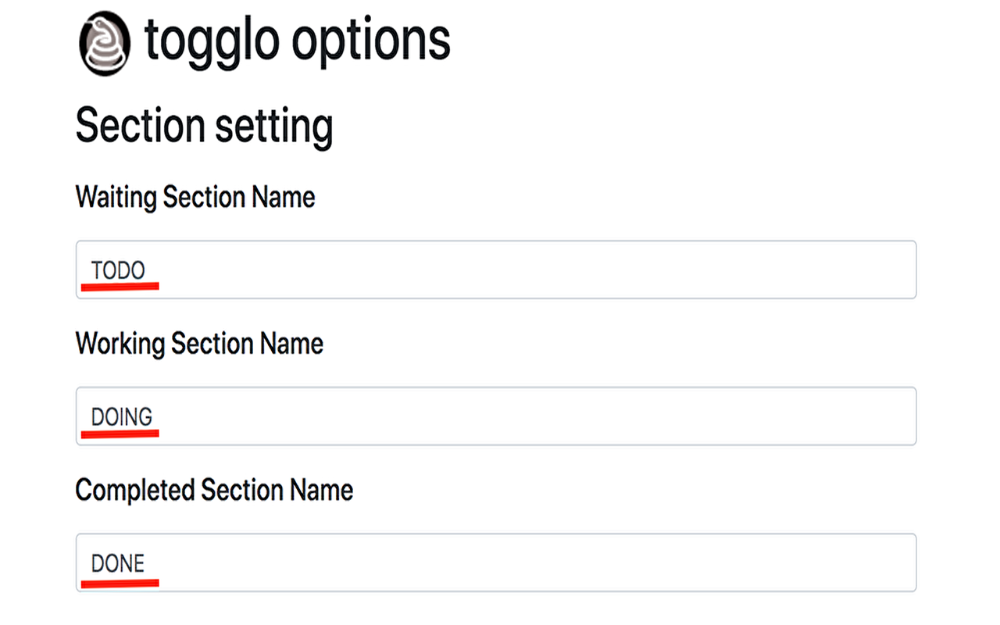
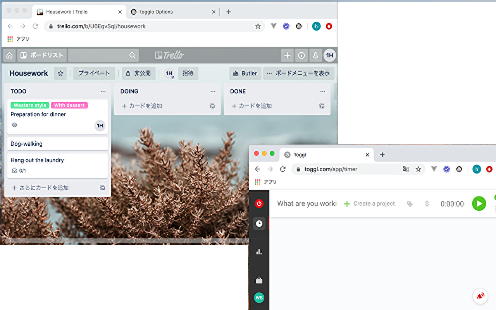
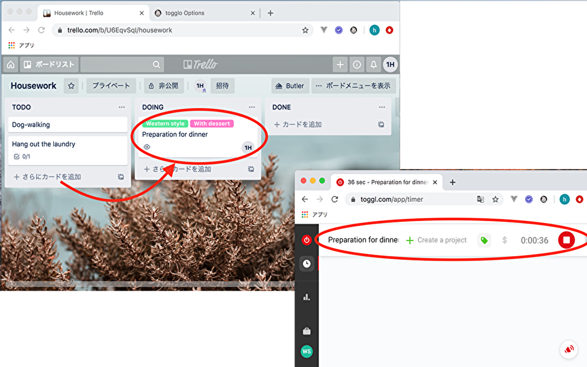
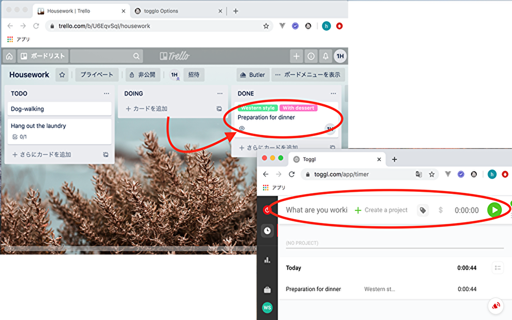

# togglo - toggl tracking for trello

- Chrome Extension
- Operate the toggl when you move the trello card.

This extension facility makes the cooperation of trello and toggl smooth.
From the list in which a card of trello expresses "work waiting".
"I'm working." when having moved to a shown list, measurement of toggl is begun.
When having moved to the list which shows "completion", measurement of toggl ends.
The title of the card and a label correspond to the contents of toggl.

toggl recognizes its task, and reacts.
Notice goes out on Chrome at the time of measurement starting of toggl and a measurement end.

I move by setting below as an option of an extension facility.

- "Work waiting" the name of the list
- "I'm working." the name of the list
- "Operational completion" the name of the list
- API key for trello
- Token for trello
- Token for toggl

## screen shot

- trello sample board
  

---

- togglo optons screen
  

---

- toggl and trello first view

---

- When you move the card to DOING, toggl measurement starts.
  

---

- When you move the card to DONE, the toggl measurement ends.
  

## privacy policy

[link](https://ito-u-oti.com/privacy-policy-for-chrome-extensions-developed-by-itouoti/)
